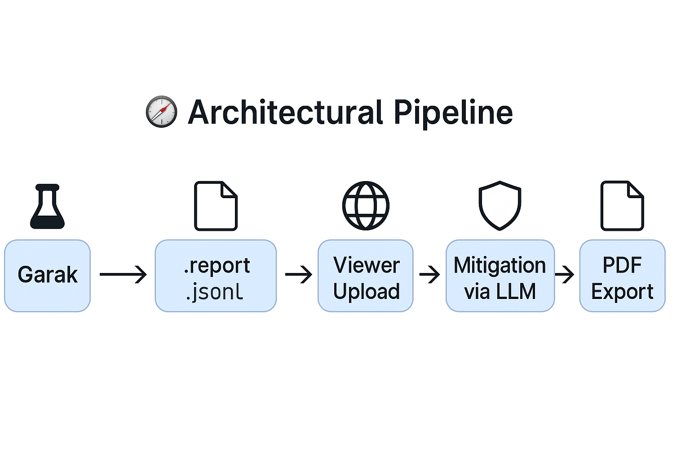

# 🧪 Garak Analyzer & Mitigator

**Garak Analyzer & Mitigator** is a web-based tool designed to analyze and enhance the safety of outputs from [Garak](https://github.com/leondz/garak), an adversarial testing framework for Large Language Models (LLMs). It provides a user-friendly interface to inspect `*.report.jsonl` files, visualize vulnerabilities, and suggest prompt-level mitigations using LLMs like OpenAI, Gemini, or local models.

---

## 🚀 Features

- 📄 **Upload** `.report.jsonl` files from Garak
- 📊 **Visualize** prompts, outputs, and trigger detection results
- 🛡️ **Mitigate** risks with automatic system prompt suggestions via LLMs
- 📥 **Export** cleaned and reviewed data to PDF for documentation

---

## 📷 Interface Preview



---

## 🛠️ Installation

1. **Clone the repository**  
   ```bash
   git clone https://github.com/yourusername/garak-analyzer.git
   cd garak-analyzer
   ```

2. **Create a virtual environment**
   ```bash
   python3 -m venv venv
   source venv/bin/activate
   ```

3. **Install dependencies**
   ```bash
   pip install -r requirements.txt
   ```

4. **Run the app**
   ```bash
   flask run
   ```

---

## 🌐 Usage

1. Launch the web interface via `http://127.0.0.1:5000`
2. Upload your Garak `.report.jsonl` file
3. Analyze test attempts, success rates, and triggers
4. Optionally, generate mitigation prompts
5. Export results to PDF

---

## 📦 Directory Structure

```
garak-analyzer/
│
├── app.py                  # Main Flask app
├── templates/              # HTML templates (Jinja2)
│   └── index.html
├── static/                 # Static files (CSS, JS, PNGs)
│   └── garak_architecture.png
├── sample.report.jsonl     # Example file
└── requirements.txt        # Python dependencies
```

---

## 🤖 Supported LLM Providers

- **OpenAI** (e.g., GPT-4)
- **Gemini** (Google Cloud)
- **Ollama** (Local models)

> Provider can be selected from the dropdown before generating mitigations.

---

## 📄 Sample Report

Use the bundled [`sample.report.jsonl`](static/sample.report.jsonl) to explore the interface without generating your own Garak report.

---

## ✍️ License

MIT License © 2025 — [Your Name](https://github.com/huseyingulsin)

---

## 🙏 Acknowledgments

- [Garak](https://github.com/leondz/garak) – for the test report framework
- [OpenAI](https://openai.com), [Google](https://ai.google), [Ollama](https://ollama.ai) – for LLMs
